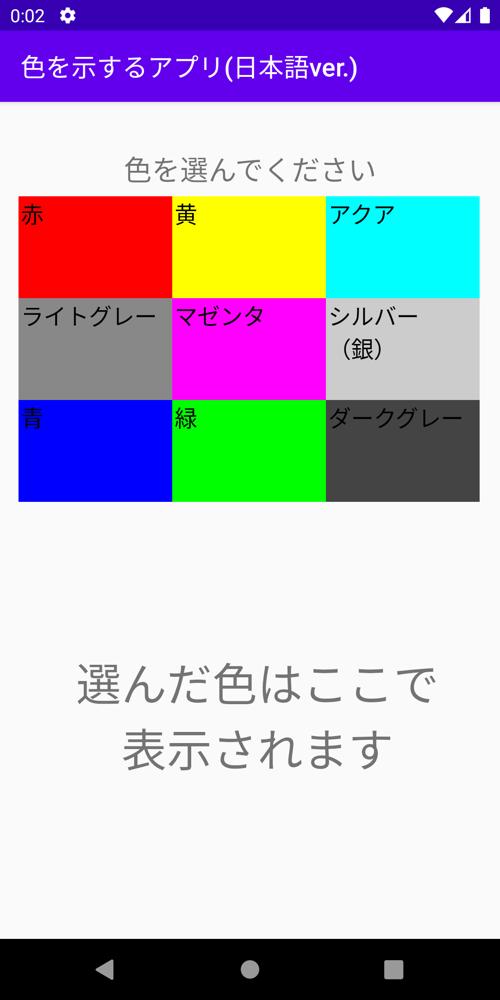
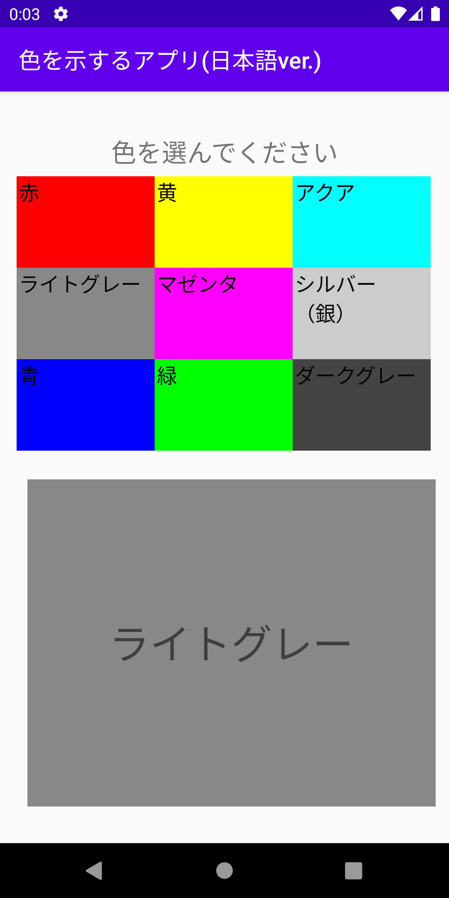
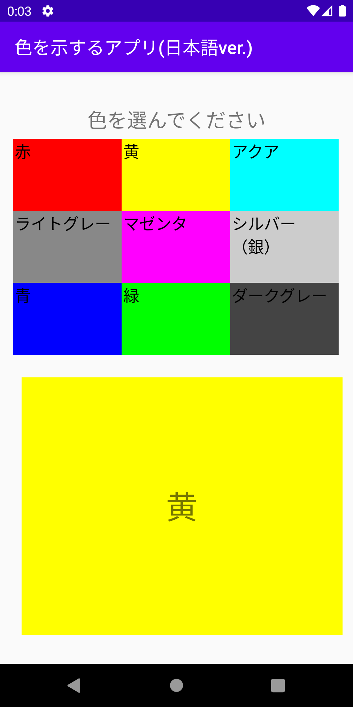
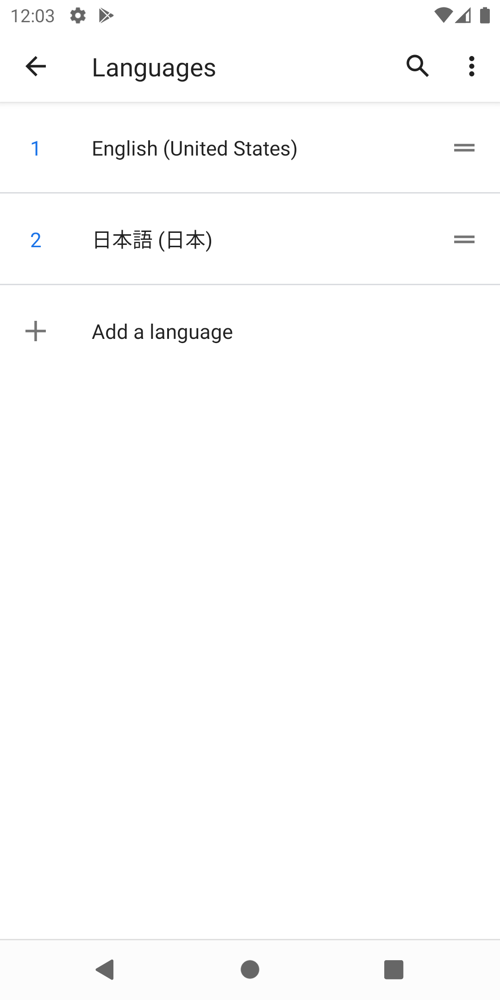
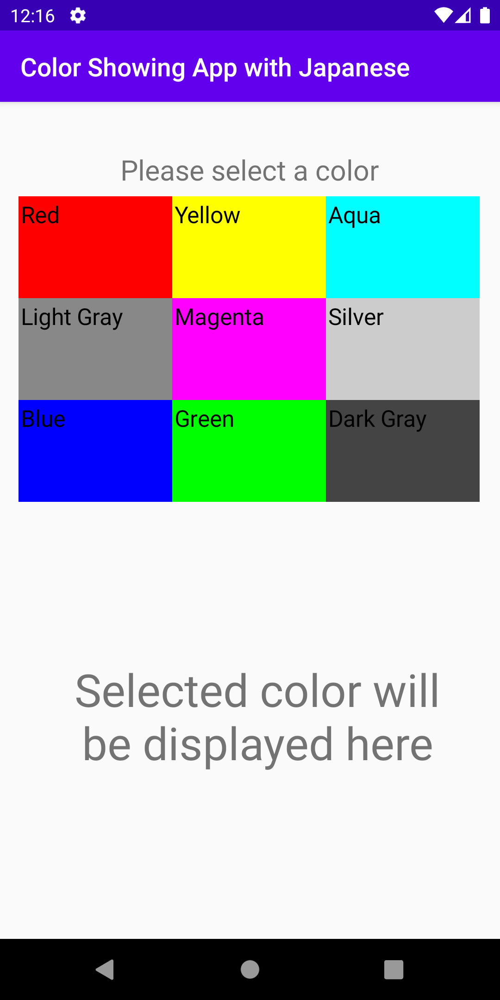
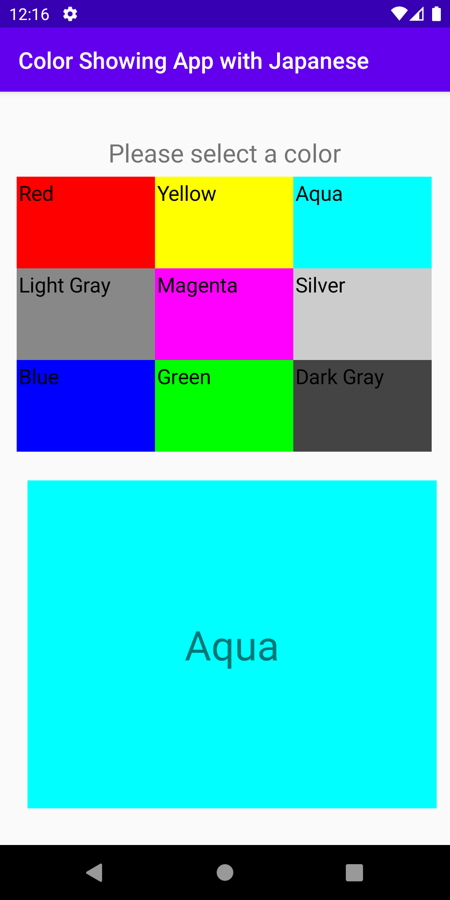
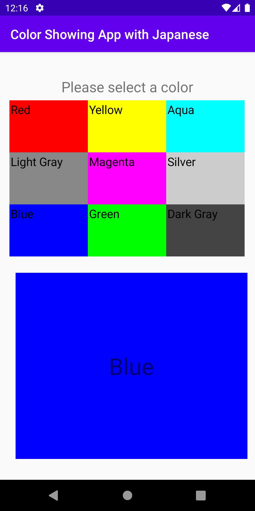



# Assignment06 Color Changing App With Japanese
Instructions:
Refactoring your last app to use a single activity along with 2 Fragments instead of 2 activities. You will then generate a signed APK with a new version number. Your app should still support an alternate language. An app that crashes gets no points.

# Application Function
This application has two fragments. One show gridView and the other one shows textView. Once the user select an item in the gridView, the other fragment will display the color and the name of the color.

As the instruction mentioned, this application supports alternate languages **but it needs to be restarted to apply the setting.**

